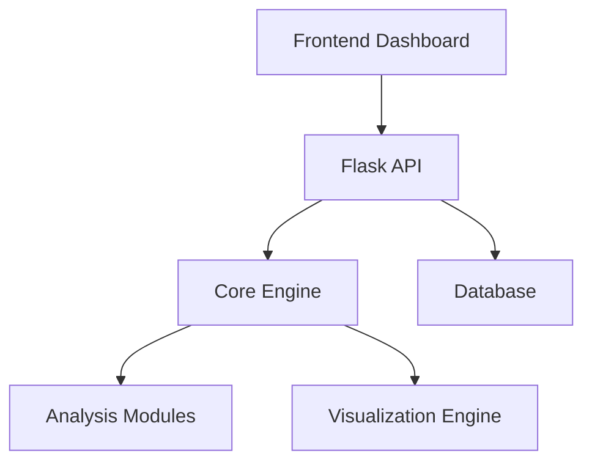

## 🎯 Objective
Create comprehensive documentation, user guides, API documentation, and developer resources to ensure easy adoption, maintenance, and contribution to the Collatz Data Science project.

## 📋 Task Description
Develop complete documentation ecosystem including user guides, API documentation, developer guides, deployment instructions, and contribution guidelines.

## ✅ Tasks Breakdown

### 1. User Documentation
- [ ] Getting Started Guide
  - [ ] Installation instructions
  - [ ] Quick start tutorial
  - [ ] Basic usage examples
  - [ ] Common use cases
- [ ] User Manual
  - [ ] Dashboard navigation guide
  - [ ] Feature explanations
  - [ ] Workflow tutorials
  - [ ] Troubleshooting guide
- [ ] FAQ Section
  - [ ] Common questions and answers
  - [ ] Known issues and solutions
  - [ ] Performance optimization tips
  - [ ] Best practices

### 2. API Documentation
- [ ] OpenAPI/Swagger specification
  - [ ] Complete endpoint documentation
  - [ ] Request/response schemas
  - [ ] Authentication details
  - [ ] Error code explanations
- [ ] API usage examples
  - [ ] Code samples in multiple languages
  - [ ] Integration examples
  - [ ] SDK documentation
  - [ ] Rate limiting guidelines
- [ ] Interactive API explorer
  - [ ] Swagger UI integration
  - [ ] Try-it-out functionality
  - [ ] Example requests/responses
  - [ ] Authentication testing

### 3. Developer Documentation
- [ ] Architecture documentation
  - [ ] System architecture overview
  - [ ] Component diagrams
  - [ ] Data flow diagrams
  - [ ] Technology stack explanation
- [ ] Code documentation
  - [ ] Module documentation
  - [ ] Class and function docstrings
  - [ ] Code examples
  - [ ] Design patterns used
- [ ] Development setup guide
  - [ ] Environment setup instructions
  - [ ] Development workflow
  - [ ] Debugging guidelines
  - [ ] Testing procedures

### 4. Deployment Documentation
- [ ] Installation guides
  - [ ] Docker deployment
  - [ ] Local development setup
  - [ ] Production deployment
  - [ ] Cloud deployment options
- [ ] Configuration documentation
  - [ ] Environment variables
  - [ ] Configuration files
  - [ ] Security settings
  - [ ] Performance tuning
- [ ] Operations manual
  - [ ] Monitoring setup
  - [ ] Backup procedures
  - [ ] Maintenance tasks
  - [ ] Troubleshooting guide

### 5. Mathematical Documentation
- [ ] Collatz Conjecture explanation
  - [ ] Mathematical background
  - [ ] Historical context
  - [ ] Current research status
  - [ ] Interesting properties
- [ ] Algorithm documentation
  - [ ] Implementation details
  - [ ] Complexity analysis
  - [ ] Optimization techniques
  - [ ] Mathematical proofs
- [ ] Statistical analysis documentation
  - [ ] Metrics explanations
  - [ ] Statistical methods used
  - [ ] Interpretation guidelines
  - [ ] Research applications

### 6. Tutorial and Examples
- [ ] Step-by-step tutorials
  - [ ] Basic sequence analysis
  - [ ] Advanced statistical analysis
  - [ ] Custom visualization creation
  - [ ] API integration examples
- [ ] Use case examples
  - [ ] Research applications
  - [ ] Educational use cases
  - [ ] Data science workflows
  - [ ] Performance analysis
- [ ] Code examples repository
  - [ ] Python examples
  - [ ] JavaScript examples
  - [ ] Jupyter notebooks
  - [ ] Integration examples

### 7. Contribution Guidelines
- [ ] Contributing guide
  - [ ] How to contribute
  - [ ] Code style guidelines
  - [ ] Pull request process
  - [ ] Issue reporting guidelines
- [ ] Development guidelines
  - [ ] Coding standards
  - [ ] Testing requirements
  - [ ] Documentation standards
  - [ ] Review process
- [ ] Community guidelines
  - [ ] Code of conduct
  - [ ] Communication channels
  - [ ] Community resources
  - [ ] Recognition system

### 8. Reference Documentation
- [ ] Configuration reference
  - [ ] All configuration options
  - [ ] Default values
  - [ ] Environment-specific settings
  - [ ] Security considerations
- [ ] CLI reference
  - [ ] Command documentation
  - [ ] Option explanations
  - [ ] Usage examples
  - [ ] Troubleshooting
- [ ] Database schema documentation
  - [ ] Table descriptions
  - [ ] Relationship diagrams
  - [ ] Index explanations
  - [ ] Migration guides

### 9. Performance and Optimization
- [ ] Performance guidelines
  - [ ] Best practices
  - [ ] Common pitfalls
  - [ ] Optimization techniques
  - [ ] Monitoring recommendations
- [ ] Scaling documentation
  - [ ] Horizontal scaling
  - [ ] Vertical scaling
  - [ ] Load balancing
  - [ ] Caching strategies
- [ ] Benchmarking guide
  - [ ] Performance testing
  - [ ] Benchmark interpretation
  - [ ] Comparison methodologies
  - [ ] Optimization tracking

### 10. Security Documentation
- [ ] Security guidelines
  - [ ] Authentication setup
  - [ ] Authorization configuration
  - [ ] Data protection
  - [ ] Vulnerability management
- [ ] Compliance documentation
  - [ ] Data privacy compliance
  - [ ] Security standards
  - [ ] Audit procedures
  - [ ] Incident response

## 🎯 Acceptance Criteria
- [ ] Complete user documentation covering all features
- [ ] Comprehensive API documentation with examples
- [ ] Developer guides enable easy contribution
- [ ] Deployment documentation supports multiple environments
- [ ] All documentation is searchable and well-organized
- [ ] Documentation is kept up-to-date with code changes

## 🔧 Technical Requirements
- [ ] MkDocs or Sphinx for documentation generation
- [ ] Swagger/OpenAPI for API documentation
- [ ] Mermaid for diagrams
- [ ] GitHub Pages for hosting
- [ ] Automated documentation building
- [ ] Version control for documentation

## 📊 Documentation Metrics
- [ ] Documentation coverage: >90% of features
- [ ] User satisfaction: >4.5/5 rating
- [ ] Documentation freshness: <1 week lag
- [ ] Search effectiveness: >80% success rate
- [ ] Tutorial completion rate: >70%
- [ ] API documentation accuracy: 100%

## 📚 Documentation Structure

```
docs/
├── user-guide/
│   ├── getting-started.md
│   ├── dashboard-guide.md
│   ├── tutorials/
│   └── faq.md
├── api/
│   ├── openapi.yaml
│   ├── endpoints.md
│   └── examples/
├── developer/
│   ├── architecture.md
│   ├── setup.md
│   ├── contributing.md
│   └── testing.md
├── deployment/
│   ├── docker.md
│   ├── production.md
│   └── configuration.md
├── mathematical/
│   ├── collatz-conjecture.md
│   ├── algorithms.md
│   └── statistics.md
└── reference/
    ├── cli.md
    ├── config.md
    └── database.md
```

## 📖 Content Examples

### User Guide Example
```markdown
# Getting Started with Collatz Data Science

## Installation

### Using Docker (Recommended)
```bash
docker-compose up -d
```

### Local Installation
```bash
pip install -r requirements.txt
python manage.py migrate
python manage.py runserver
```

## Your First Analysis

1. Open the dashboard at http://localhost:8000
2. Enter a number in the sequence generator
3. Click "Analyze" to see the results
4. Explore the visualizations and statistics
```

### API Documentation Example
```yaml
# OpenAPI specification excerpt
paths:
  /api/sequence:
    post:
      summary: Generate Collatz sequence
      requestBody:
        required: true
        content:
          application/json:
            schema:
              type: object
              properties:
                number:
                  type: integer
                  minimum: 1
                  example: 5
      responses:
        200:
          description: Sequence generated successfully
          content:
            application/json:
              schema:
                type: object
                properties:
                  sequence:
                    type: array
                    items:
                      type: integer
                    example: [5, 16, 8, 4, 2, 1]
```

### Developer Guide Example
```markdown
# Architecture Overview

## System Components



## Core Modules

- **collatz.core**: Sequence generation and analysis
- **collatz.api**: REST API endpoints
- **collatz.dashboard**: Streamlit dashboard
- **collatz.database**: Data persistence layer
```

## 🔍 Quality Assurance
- [ ] Documentation review process
  - [ ] Technical accuracy review
  - [ ] User experience review
  - [ ] Language and clarity review
  - [ ] Example validation
- [ ] Automated documentation testing
  - [ ] Link validation
  - [ ] Code example testing
  - [ ] API documentation sync
  - [ ] Screenshot updates
- [ ] User feedback integration
  - [ ] Feedback collection system
  - [ ] Regular user surveys
  - [ ] Documentation analytics
  - [ ] Continuous improvement

## 📱 Multi-format Documentation
- [ ] Web documentation (primary)
  - [ ] Responsive design
  - [ ] Search functionality
  - [ ] Navigation optimization
  - [ ] Mobile-friendly
- [ ] PDF exports
  - [ ] User manual PDF
  - [ ] API reference PDF
  - [ ] Quick reference cards
  - [ ] Offline documentation
- [ ] Interactive tutorials
  - [ ] In-app guidance
  - [ ] Interactive examples
  - [ ] Progressive disclosure
  - [ ] Contextual help

## 🌐 Internationalization
- [ ] Multi-language support preparation
  - [ ] Documentation structure for i18n
  - [ ] Translation workflow
  - [ ] Language-specific examples
  - [ ] Cultural considerations
- [ ] Accessibility compliance
  - [ ] Screen reader compatibility
  - [ ] Keyboard navigation
  - [ ] Color contrast compliance
  - [ ] Alternative text for images

## 🔄 Documentation Maintenance
- [ ] Automated updates
  - [ ] API documentation sync
  - [ ] Version synchronization
  - [ ] Broken link detection
  - [ ] Content freshness monitoring
- [ ] Regular review cycles
  - [ ] Quarterly documentation review
  - [ ] User feedback incorporation
  - [ ] Technology update reflection
  - [ ] Performance optimization

## 🔗 Dependencies
- Requires: All previous milestones (#1-#7)
- Blocks: Production Deployment
- Blocks: Community Release

## ⏱️ Estimated Duration
2-3 weeks

## 🚀 Priority
**Medium** - Important for user adoption and project sustainability.

## 📋 Definition of Done
- [ ] All documentation categories complete
- [ ] Documentation website deployed
- [ ] Search functionality operational
- [ ] User feedback system in place
- [ ] Documentation maintenance process established
- [ ] Team trained on documentation updates
- [ ] Analytics and monitoring configured
- [ ] Accessibility compliance verified