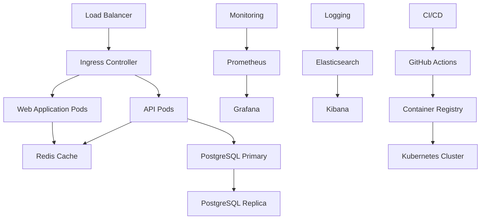

## 🎯 Objective
Deploy the Collatz Data Science application to production with robust infrastructure, monitoring, security, and scalability features.

## 📋 Task Description
Implement production-ready deployment with containerization, orchestration, monitoring, security hardening, and automated deployment pipelines.

## ✅ Tasks Breakdown

### 1. Infrastructure Setup
- [ ] Cloud platform selection and setup
  - [ ] AWS/Azure/GCP account configuration
  - [ ] VPC and networking setup
  - [ ] Security groups and firewall rules
  - [ ] Load balancer configuration
- [ ] Container orchestration
  - [ ] Kubernetes cluster setup
  - [ ] Docker Swarm alternative
  - [ ] Container registry setup
  - [ ] Image management strategy
- [ ] Database infrastructure
  - [ ] Production PostgreSQL setup
  - [ ] Database clustering/replication
  - [ ] Backup and recovery systems
  - [ ] Performance optimization

### 2. Production Docker Configuration
- [ ] Multi-stage Docker builds
  - [ ] Optimized production images
  - [ ] Security scanning integration
  - [ ] Image size optimization
  - [ ] Layer caching strategies
- [ ] Docker Compose production setup
  - [ ] Production-specific configurations
  - [ ] Resource limits and constraints
  - [ ] Health checks implementation
  - [ ] Restart policies
- [ ] Container security
  - [ ] Non-root user configuration
  - [ ] Minimal base images
  - [ ] Vulnerability scanning
  - [ ] Secret management

### 3. Kubernetes Deployment
- [ ] Kubernetes manifests
  - [ ] Deployment configurations
  - [ ] Service definitions
  - [ ] ConfigMaps and Secrets
  - [ ] Ingress controllers
- [ ] Helm charts
  - [ ] Chart development
  - [ ] Values configuration
  - [ ] Template customization
  - [ ] Chart testing
- [ ] Auto-scaling configuration
  - [ ] Horizontal Pod Autoscaler
  - [ ] Vertical Pod Autoscaler
  - [ ] Cluster autoscaling
  - [ ] Resource quotas

### 4. CI/CD Pipeline
- [ ] GitHub Actions workflows
  - [ ] Build and test pipeline
  - [ ] Security scanning
  - [ ] Image building and pushing
  - [ ] Deployment automation
- [ ] Deployment strategies
  - [ ] Blue-green deployment
  - [ ] Rolling updates
  - [ ] Canary deployments
  - [ ] Rollback procedures
- [ ] Environment promotion
  - [ ] Development to QA
  - [ ] QA to UAT
  - [ ] UAT to Production
  - [ ] Approval workflows

### 5. Monitoring and Observability
- [ ] Application monitoring
  - [ ] Prometheus setup
  - [ ] Grafana dashboards
  - [ ] Custom metrics collection
  - [ ] SLA monitoring
- [ ] Log management
  - [ ] Centralized logging (ELK stack)
  - [ ] Log aggregation
  - [ ] Log retention policies
  - [ ] Log analysis and alerting
- [ ] Distributed tracing
  - [ ] Jaeger or Zipkin setup
  - [ ] Request tracing
  - [ ] Performance bottleneck identification
  - [ ] Service dependency mapping
- [ ] Error tracking
  - [ ] Sentry integration
  - [ ] Error aggregation
  - [ ] Alert notifications
  - [ ] Error trend analysis

### 6. Security Implementation
- [ ] Network security
  - [ ] TLS/SSL certificate management
  - [ ] Network policies
  - [ ] VPN access
  - [ ] DDoS protection
- [ ] Application security
  - [ ] Authentication hardening
  - [ ] Authorization enforcement
  - [ ] Input validation
  - [ ] Security headers
- [ ] Infrastructure security
  - [ ] OS hardening
  - [ ] Container security
  - [ ] Secret management (Vault)
  - [ ] Regular security updates
- [ ] Compliance and auditing
  - [ ] Security audit logging
  - [ ] Compliance monitoring
  - [ ] Vulnerability assessments
  - [ ] Penetration testing

### 7. Performance Optimization
- [ ] Caching implementation
  - [ ] Redis cluster setup
  - [ ] CDN configuration
  - [ ] Application-level caching
  - [ ] Database query caching
- [ ] Load balancing
  - [ ] Application load balancer
  - [ ] Database load balancing
  - [ ] Session affinity
  - [ ] Health check configuration
- [ ] Database optimization
  - [ ] Connection pooling
  - [ ] Query optimization
  - [ ] Index optimization
  - [ ] Read replicas

### 8. Backup and Disaster Recovery
- [ ] Data backup strategies
  - [ ] Automated database backups
  - [ ] File system backups
  - [ ] Cross-region replication
  - [ ] Backup testing procedures
- [ ] Disaster recovery planning
  - [ ] Recovery time objectives (RTO)
  - [ ] Recovery point objectives (RPO)
  - [ ] Failover procedures
  - [ ] Business continuity planning
- [ ] High availability setup
  - [ ] Multi-zone deployment
  - [ ] Redundancy implementation
  - [ ] Automatic failover
  - [ ] Health monitoring

### 9. Configuration Management
- [ ] Environment configuration
  - [ ] Production environment variables
  - [ ] Configuration validation
  - [ ] Secret rotation
  - [ ] Feature flag management
- [ ] Infrastructure as Code
  - [ ] Terraform configurations
  - [ ] CloudFormation templates
  - [ ] Ansible playbooks
  - [ ] Version control for infrastructure
- [ ] Configuration drift detection
  - [ ] Automated compliance checking
  - [ ] Configuration monitoring
  - [ ] Drift remediation
  - [ ] Change tracking

### 10. Operational Procedures
- [ ] Deployment procedures
  - [ ] Deployment checklists
  - [ ] Rollback procedures
  - [ ] Emergency procedures
  - [ ] Communication protocols
- [ ] Maintenance procedures
  - [ ] Scheduled maintenance windows
  - [ ] Update procedures
  - [ ] Capacity planning
  - [ ] Performance tuning
- [ ] Incident response
  - [ ] Incident classification
  - [ ] Response procedures
  - [ ] Escalation paths
  - [ ] Post-incident reviews

## 🎯 Acceptance Criteria
- [ ] Application successfully deployed to production
- [ ] 99.9% uptime SLA achieved
- [ ] Automated deployment pipeline operational
- [ ] Monitoring and alerting fully configured
- [ ] Security hardening implemented
- [ ] Backup and recovery procedures tested

## 🔧 Technical Requirements
- [ ] Kubernetes cluster (EKS/AKS/GKE)
- [ ] Container registry (ECR/ACR/GCR)
- [ ] Monitoring stack (Prometheus/Grafana)
- [ ] Log management (ELK/EFK stack)
- [ ] Secret management (Vault/AWS Secrets Manager)
- [ ] CI/CD platform (GitHub Actions)

## 📊 Production Metrics
- [ ] Uptime: >99.9%
- [ ] Response time: <200ms (95th percentile)
- [ ] Error rate: <0.1%
- [ ] Deployment frequency: Daily
- [ ] Mean time to recovery: <30 minutes
- [ ] Security scan: 0 critical vulnerabilities

## 🏗️ Infrastructure Architecture



## 🚀 Deployment Pipeline

```yaml
# Example GitHub Actions workflow
name: Production Deployment

on:
  push:
    branches: [main]

jobs:
  test:
    runs-on: ubuntu-latest
    steps:
      - uses: actions/checkout@v3
      - name: Run tests
        run: |
          docker-compose -f docker-compose.test.yml up --abort-on-container-exit
  
  security-scan:
    runs-on: ubuntu-latest
    steps:
      - uses: actions/checkout@v3
      - name: Security scan
        run: |
          docker run --rm -v $(pwd):/app securecodewarrior/docker-security-scan
  
  build-and-deploy:
    needs: [test, security-scan]
    runs-on: ubuntu-latest
    steps:
      - uses: actions/checkout@v3
      - name: Build and push images
        run: |
          docker build -t myregistry/collatz-app:${{ github.sha }} .
          docker push myregistry/collatz-app:${{ github.sha }}
      
      - name: Deploy to production
        run: |
          kubectl set image deployment/collatz-app app=myregistry/collatz-app:${{ github.sha }}
          kubectl rollout status deployment/collatz-app
```

## 🔒 Security Checklist
- [ ] TLS encryption for all communications
- [ ] Network segmentation implemented
- [ ] Container images scanned for vulnerabilities
- [ ] Secrets properly managed and rotated
- [ ] Access controls and RBAC configured
- [ ] Security monitoring and alerting active
- [ ] Regular security assessments scheduled
- [ ] Incident response procedures documented

## 📋 Production Readiness Checklist
- [ ] Performance testing completed
- [ ] Security testing passed
- [ ] Disaster recovery tested
- [ ] Monitoring and alerting configured
- [ ] Documentation updated
- [ ] Team training completed
- [ ] Support procedures established
- [ ] Compliance requirements met

## 🔍 Monitoring Dashboards
- [ ] Application performance dashboard
  - [ ] Response times
  - [ ] Error rates
  - [ ] Throughput metrics
  - [ ] User activity
- [ ] Infrastructure dashboard
  - [ ] CPU and memory usage
  - [ ] Network metrics
  - [ ] Storage utilization
  - [ ] Container health
- [ ] Business metrics dashboard
  - [ ] User engagement
  - [ ] Feature usage
  - [ ] Performance trends
  - [ ] Cost optimization

## 🚨 Alerting Rules
- [ ] Critical alerts
  - [ ] Application down
  - [ ] High error rate (>1%)
  - [ ] Response time >1s
  - [ ] Database connection failures
- [ ] Warning alerts
  - [ ] High CPU usage (>80%)
  - [ ] High memory usage (>85%)
  - [ ] Disk space low (<20%)
  - [ ] SSL certificate expiring
- [ ] Info alerts
  - [ ] Deployment completed
  - [ ] Backup completed
  - [ ] Scaling events
  - [ ] Configuration changes

## 🔗 Dependencies
- Requires: All previous milestones (#1-#8)
- Blocks: Advanced Features and Research Tools
- Blocks: Community Release

## ⏱️ Estimated Duration
3-4 weeks

## 🚀 Priority
**High** - Critical for production launch and user access.

## 📝 Production Environment
- [ ] Production URL: https://collatz.example.com
- [ ] Admin dashboard: https://admin.collatz.example.com
- [ ] API endpoint: https://api.collatz.example.com
- [ ] Monitoring: https://monitoring.collatz.example.com
- [ ] Documentation: https://docs.collatz.example.com

## 📋 Definition of Done
- [ ] Production environment fully operational
- [ ] All services deployed and accessible
- [ ] Monitoring and alerting active
- [ ] Security measures implemented
- [ ] Backup and recovery tested
- [ ] Team trained on production operations
- [ ] Documentation updated with production details
- [ ] Performance benchmarks met